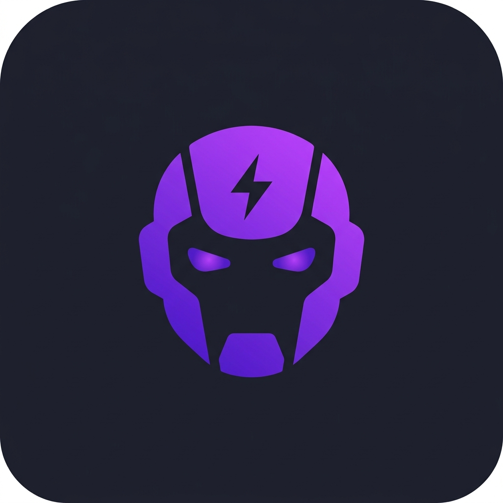
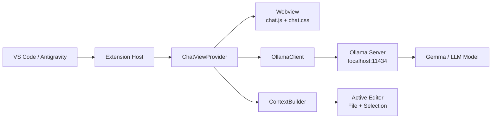

<


<p align="center">
  
</p>

---

## ✨ Features

| Feature | Description |
|---------|-------------|
| 🔒 **100% Offline** | Ollama 로컬 서버만 있으면 인터넷 없이 완전 동작 |
| 💬 **실시간 스트리밍** | SSE 기반 토큰 단위 실시간 응답 렌더링 |
| 📝 **Markdown 렌더링** | 코드 블록, 볼드, 이탤릭, 리스트 등 완전 지원 |
| 🔄 **모델 전환** | 상태바 클릭 한 번으로 Ollama 모델 핫스왑 |
| 📋 **코드 복사/삽입** | AI 응답의 코드 블록을 클릭 한 번으로 에디터에 삽입 |
| 🎯 **코드 컨텍스트** | 현재 파일 + 선택 영역을 자동으로 프롬프트에 포함 |
| ⌨️ **단축키 지원** | `Ctrl+Shift+L`로 선택 코드 즉시 질문 |
| 🎨 **VS Code 네이티브 UI** | 사이드바 Webview로 완벽한 다크 테마 연동 |

---

## 📸 Screenshots

<p align="center">
  
  <br/>
  <em>Sidebar chat with real-time streaming and markdown rendering</em>
</p>

---

## 🚀 Quick Start

### 1. Ollama 설치

```bash
# Windows (PowerShell)
winget install Ollama.Ollama

# macOS
brew install ollama

# Linux
curl -fsSL https://ollama.com/install.sh | sh
```

### 2. 모델 다운로드

```bash
# 추천: Gemma 4 (경량 E4B 버전)
ollama pull gemma4:e4b

# 또는 Gemma 2 (2B, 초경량)
ollama pull gemma2:2b

# 커스텀 모델 생성 (선택사항)
ollama create gemma4:e4b -f models/Modelfile_e4b
```

### 3. Ollama 서버 시작

```bash
ollama serve
```

### 4. Extension 설치

#### Option A: VSIX 직접 설치 (권장)
```bash
code --install-extension lica-offline-1.0.0.vsix
```

#### Option B: 소스에서 빌드
```bash
git clone https://github.com/sunjongos/lica-offline.git
cd lica-offline
npm install
npm run compile
npx vsce package --no-dependencies
code --install-extension lica-offline-1.0.0.vsix
```

---

## 📁 Project Structure

```
lica-offline/
├── src/
│   ├── extension.ts          # Extension entry point & command registration
│   ├── chatViewProvider.ts   # Webview sidebar provider (core logic)
│   ├── ollamaClient.ts      # Ollama HTTP API client (streaming + batch)
│   └── contextBuilder.ts    # Editor context extraction (file, selection)
├── media/
│   ├── chat.css              # Webview UI styles (VS Code native theme)
│   └── chat.js               # Webview frontend (markdown renderer, events)
├── resources/
│   ├── icon.png              # Extension marketplace icon
│   └── icon.svg              # Activity bar icon
├── models/
│   └── Modelfile_e4b         # Custom Ollama Modelfile for E4B persona
├── package.json              # Extension manifest & configuration schema
├── tsconfig.json             # TypeScript compiler options
├── .vscodeignore             # VSIX packaging exclusions
├── .gitignore
├── CHANGELOG.md
├── LICENSE
└── README.md
```

---

## ⚙️ Configuration

Settings > Extensions > Luca Offline 에서 설정 가능합니다.

| Setting | Default | Description |
|---------|---------|-------------|
| `lucaOffline.ollamaUrl` | `http://localhost:11434` | Ollama 서버 URL |
| `lucaOffline.defaultModel` | `gemma4:e4b` | 기본 사용 모델 |
| `lucaOffline.systemPrompt` | *(한국어 코딩 어시스턴트)* | 시스템 프롬프트 |
| `lucaOffline.maxContextLines` | `200` | 컨텍스트로 전송할 최대 코드 라인 수 |

---

## 🎮 Commands & Keybindings

| Command | Keybinding | Description |
|---------|-----------|-------------|
| `Luca Offline: 채팅 열기` | — | 사이드바 채팅 패널 포커스 |
| `Luca Offline: 선택한 코드 질문하기` | `Ctrl+Shift+L` | 선택 영역 + 질문 전송 |
| `Luca Offline: 모델 전환` | *(상태바 클릭)* | QuickPick으로 모델 전환 |
| `Luca Offline: 대화 초기화` | — | 채팅 히스토리 리셋 |

---

## 🏗️ Architecture



**핵심 설계 원칙:**
- **Zero Dependencies** — `node:http` 만 사용, 외부 라이브러리 없음
- **Streaming First** — SSE 기반 실시간 토큰 렌더링
- **VS Code Native** — Webview CSP 정책 완전 준수
- **Offline First** — 네트워크 연결 불필요, 로컬 전용

---

## 🛠️ Development

```bash
# 의존성 설치
npm install

# 컴파일
npm run compile

# 감시 모드 (개발용)
npm run watch

# VSIX 패키징
npm run package
```

### 디버깅
1. VS Code에서 이 프로젝트를 열기
2. `F5` → Extension Development Host 실행
3. 사이드바에서 Luca Offline 아이콘 클릭

---

## 🌐 Compatible Editors

| Editor | Status | Notes |
|--------|--------|-------|
| VS Code | ✅ 완전 지원 | 공식 지원 대상 |
| Antigravity | ✅ 완전 지원 | VS Code 기반이므로 동일하게 동작 |
| Cursor | ✅ 호환 | VS Code 포크 기반 |
| Windsurf | ⚠️ 미검증 | 가능할 것으로 예상 |

---

## 📜 Custom Modelfile

`models/Modelfile_e4b` 를 수정하여 나만의 AI 어시스턴트 페르소나를 만들 수 있습니다:

```dockerfile
FROM gemma2:2b
SYSTEM """
Your custom system prompt here.
"""
```

```bash
ollama create my-assistant -f models/Modelfile_e4b
```

---

## 🤝 Contributing

1. Fork this repository
2. Create your feature branch (`git checkout -b feature/amazing-feature`)
3. Commit your changes (`git commit -m 'Add amazing feature'`)
4. Push to the branch (`git push origin feature/amazing-feature`)
5. Open a Pull Request

---

## 📄 License

This project is licensed under the MIT License — see the [LICENSE](LICENSE) file for details.

---

## 🙏 Acknowledgments

- **[Ollama](https://ollama.com)** — Local LLM inference engine
- **[Google Gemma](https://ai.google.dev/gemma)** — Open-source LLM family
- **[VS Code Extension API](https://code.visualstudio.com/api)** — Webview & sidebar APIs

---

<p align="center">
  Made with ❤️ by <a href="https://github.com/sunjongos">@sunjongos</a>
  <br/>
  <sub>🇰🇷 AI 1인 기업을 위한 오프라인 코딩 어시스턴트</sub>
</p>
]]>
